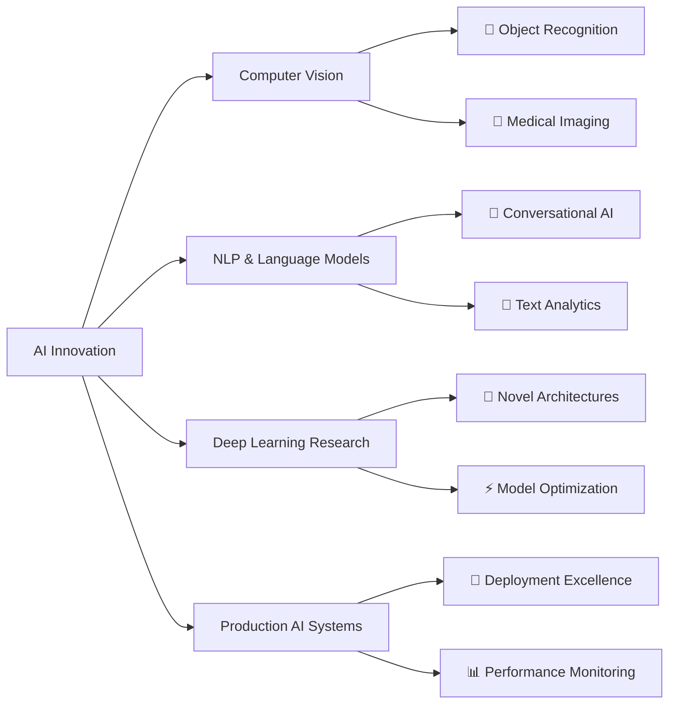

<div align="center">


</div>

<div align="center">


</div>

<div align="center">

[](https://linkedin.com/in/thisara-randinu)
[](https://your-portfolio.com)
[](mailto:your.email@example.com)
[](https://kaggle.com/thisararandinu)

</div>

---

## 🤖 Professional Profile

```python
class EliteAIEngineer:
    def __init__(self):
        self.name = "Thisara Randinu"
        self.location = "Sri Lanka 🇱🇰"
        self.title = "Senior AI/ML Engineer & Research Specialist"
        self.expertise = [
            "Advanced Machine Learning Architecture",
            "Deep Neural Network Design",
            "Computer Vision & NLP Solutions", 
            "Production AI System Deployment",
            "Research & Development Leadership"
        ]
        self.achievements = "Building next-generation AI solutions"
        
    def get_vision(self):
        return "Transforming industries through intelligent automation"

engineer = EliteAIEngineer()
print(f"Mission: {engineer.get_vision()}")
```

### 🎯 Core Specializations

- 🧠 **Advanced Model Training**: Custom neural architectures for specialized domains
- 🔬 **AI Research**: Publishing-quality experiments and innovations
- 🏗️ **MLOps Excellence**: Scalable, production-ready AI pipelines
- 📊 **Data Science Leadership**: Complex analytics and predictive modeling
- 🌐 **Full-Stack AI Integration**: End-to-end intelligent applications
- ☁️ **Cloud AI Solutions**: Enterprise-grade scalable deployments

---

## 🛠️ Technology Excellence

<div align="center">

### 🧬 AI/ML Mastery


### 🐍 Programming Excellence  


### 📊 Data Science Stack


### ☁️ Cloud & Infrastructure


</div>

---

## 📊 Performance Analytics

<div align="center">


</div>

<div align="center">
  


</div>

---

## 🏆 Professional Recognition

<div align="center">


</div>

---

## 🎨 Innovation Portfolio

<div align="center">

### 🚀 AI Excellence Showcase

<table>
<tr>
<td width="50%">

### 🧠 Machine Learning Solutions
- **🔮 Predictive Analytics**: Advanced forecasting models
- **🎯 Classification Systems**: High-accuracy decision engines  
- **📊 Recommendation AI**: Personalized content algorithms
- **🏥 Healthcare AI**: Medical diagnosis assistance tools

</td>
<td width="50%">

### 🌐 Production Applications
- **⚡ Real-time Processing**: Low-latency AI inference
- **🔄 MLOps Pipelines**: Automated model deployment
- **📱 Mobile AI**: Edge computing solutions
- **🌍 Scalable APIs**: Enterprise-grade AI services

</td>
</tr>
</table>

### 📈 Research Impact Areas



</div>

---

## 🌟 Professional Excellence

<div align="center">

<table>
<tr>
<td align="center" width="300">

<br />
<strong>Thisara Randinu</strong>
<br />
<em>🎯 AI/ML Engineering Specialist</em>
<br />
<em>🔬 Research & Development Lead</em>
<br />
<em>🌍 Global Innovation Contributor</em>
<br />
📍 Sri Lanka 🇱🇰
</td>
<td width="450">

### 🤝 Collaboration Excellence

- 🔬 **Research Leadership**: Spearheading cutting-edge AI projects
- 🏢 **Enterprise Solutions**: Fortune 500 AI implementations  
- 🎓 **Knowledge Leadership**: Training next-generation AI talent
- 🌍 **Global Impact**: International AI project contributions
- 📊 **Consulting Excellence**: Strategic AI transformation guidance

### 🎯 Professional Goals 2024-2025
- ✅ **Advanced Research**: Publishing breakthrough AI methodologies
- ✅ **Open Source Impact**: Contributing to major ML frameworks
- ✅ **Industry Recognition**: Speaking at international AI conferences
- ✅ **Startup Innovation**: Founding AI-first technology ventures

</td>
</tr>
</table>

</div>

---

## 📞 Professional Network

<div align="center">

### 🤝 Connect for Opportunities

[](https://linkedin.com/in/thisara-randinu)
[](https://kaggle.com/thisararandinu)
[](https://your-portfolio.com)
[](mailto:your.email@example.com)

</div>

---

<div align="center">

### 💭 Innovation Philosophy

*"The most powerful AI solutions are those that seamlessly integrate human insight with machine intelligence."*

### 🌟 Mission Statement

**Developing AI systems that don't just process data, but truly understand and solve complex human challenges** 🚀

---

### 🎖️ Professional Commitment

**🔬 Research Excellence** • **🏗️ Production Quality** • **🌍 Global Impact** • **🤝 Knowledge Sharing**

---


</div>
